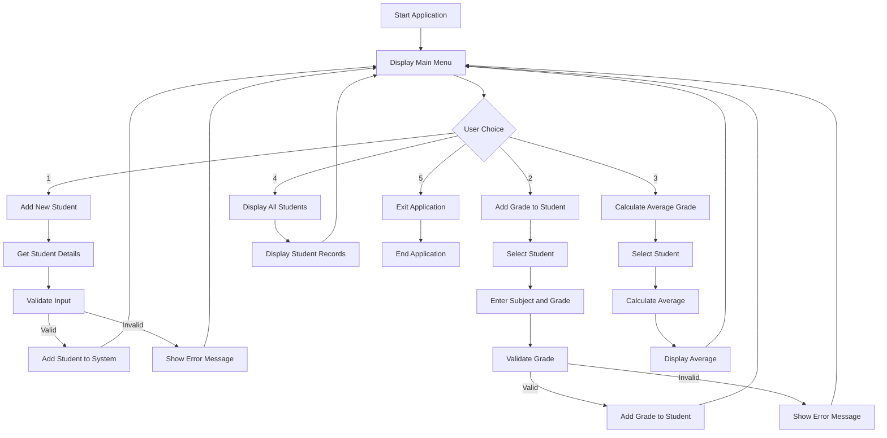

# Student Grade Management System - Design Outline

## Application Flowchart

## Code Components

### Classes and Data Structures
1. **Student Class**
   - Properties: StudentID, Name, Dictionary<string, double> for Subjects and Grades
   - Methods: AddGrade, CalculateAverage, ToString

2. **GradeManager Class**
   - Properties: List<Student> Students
   - Methods: AddStudent, FindStudent, DisplayAllStudents

### Variables
- students: List<Student> - Stores all student records
- choice: int - Stores user menu selection
- studentId: string - Unique identifier for students
- studentName: string - Student's name
- subject: string - Subject name
- grade: double - Grade value

### Control Structures
- **Switch Statement**: For handling menu choices
- **If-Else Statements**: For input validation and error handling

### Loops
- **While Loop**: For main application loop to keep menu running
- **For Loop**: For displaying lists of students

### Methods
1. **Main()**: Entry point, runs the main application loop
2. **DisplayMenu()**: Shows options to the user
3. **AddStudent()**: Handles adding new students
4. **AddGrade()**: Handles adding grades to existing students
5. **CalculateAverage()**: Calculates and displays average grade for a student
6. **DisplayAllStudents()**: Shows all students and their grades
7. **FindStudent()**: Helper method to find a student by ID
8. **GetValidGrade()**: Helper method to validate grade input

## Task Breakdown
1. Create Student class with properties and methods
2. Create GradeManager class to manage student collection
3. Implement main application loop with menu
4. Implement user input handling
5. Implement validation for inputs
6. Test all functionality